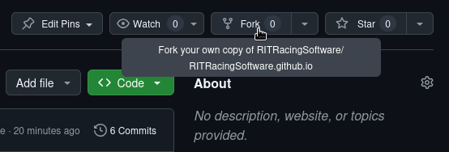

---
hide:
  - navigation
  - toc
---

To contribute, follow the steps below:

Documentation repository: [https://github.com/RITRacingSoftware/RITRacingSoftware.github.io](https://github.com/RITRacingSoftware/RITRacingSoftware.github.io)

(1) Fork the documentation repository. (A Github account is required)
<div style="text-align: center;">
      
</div>

(2) Clone the repository.
```
git clone https://github.com/<Your_Github_Username>/RITRacingSoftware.github.io

cd RITRacingSoftware.github.io/
```

(3) Create or update documentation.

- [Material for MkDocs](https://squidfunk.github.io/mkdocs-material/) follows a directory based layout for routing to pages within a sites documentation (found in `docs/`). This means that a directory creates a new folder and any files within the folder will show up as pages on the site.
```
Example Site layout
├── docs
│   ├── Hardware
│   │   └── MCU.md
│   ├── index.md
│   ├── Firmware
│   │   └── index.md
│   └── stylesheets
│       └── extra.css
```
- To include any graphical assets, add an image to the desired folder and refer to it within any markdown file through the following directive. <i>HTML is preferred as images can be easily centered without fuss</i>
```html
<div style="text-align: center;">
    
</div>
```

(4) Once you have finished adding docmentation push the changes to your accounts repositories and click the `Contribute` button to create a pull request.
```bash
git add docs/info/myfile.md
git commit -m "create more documentation"
git push
```